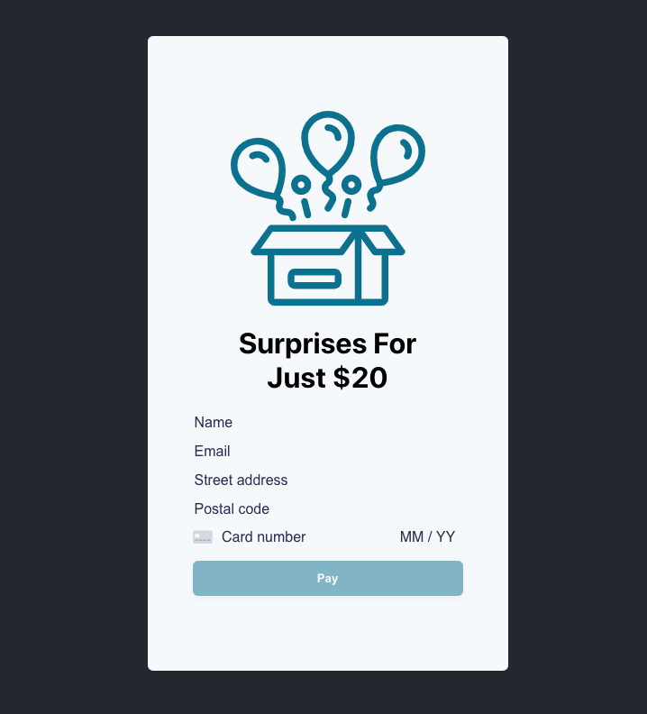

# 😲🎁 Surprise Me! 1.0

# About

Surprise me! is my new e-commerce business that is all about customers paying $20 for the opportunity to have me send them random wild stuff. You never know what you’ll get, but I promise it’ll be memorable. 

This web app was built using React and Node.JS (Express to be precise). Coming in, I didn’t know how to use either of those things, so while it was a cool experience, please excuse any n00b code (but it should all work!). 

Running the code will bring up a page where you are required to enter your name, email, and credit card information. All of that information is required and there is some LIGHT enforcement to do things like check names/emails etc. 

# How To Run It Locally

1. Clone this repository to your machine
2. Install [NodeJs](https://nodejs.org/en/)! 
3. Rename .env.example to .env and update it with your test secret key and test publishable key. You can get your API keys from the [Stripe Dashboard](https://dashboard.stripe.com/apikeys). Make sure you are using your test keys, not your live keys. You can do that by flipping the “view test data” toggle in the Stripe Dashboard.
4. Open terminal and go to the root of your cloned repository. Run `npm install` in there 
5. Then navigate to the client folder and run `npm install` there too. I’m sure there is an easier way to do this but we’ll roll with it. 
6. Lastly, go back to the root of your cloned directory and run: `npm run dev`
7. Give it a minute and a browser window should pop up with the Surprise Me! purchase site. If it doesn’t, just open up a chrome window and type in [_http://localhost:3000/_](http://localhost:3000/). 
8. Voilà, start sending me fake money (or real)

# How To Test

### Testing main functionality

1. In the local instance of the web app, try putting in different card numbers, expiration dates etc and notice how it enforces all the card requirements. In addition it will enforce name and email. 
2. You can test different card states as well using the following card numbers and any CVC, Zip, and future expiration date

| Test card number     | Expected Result | Declining on card authentication |
:--- | :--- | :---
**4242424242424242** | Succeeds  | N/A |
**4000002500003155** | Displays a pop-up modal to authenticate  | Declines and asks customer for new card |
**4000000000009995** | Gives customer insufficient funds error  | N/A |

### Testing transaction log

1. Surprise Me! also features complete server side logging of completed sales, powered by Stripe webhooks. You can view see this in action by installing Stripe CLI and running: `stripe listen --forward-to localhost:9000/paymentProcessing/webhook`. 
2. Then in another terminal window run: `stripe trigger payment_intent.succeeded` or go to the web app and try a successful purchase using the card number above. 
3. You’ll notice in the terminal window that you ran listen a few 200 POSTs and if you navigate to salesLog.txt in your cloned directory you’ll see a log for that sale. This will log Billing/shipping information based on the source of the sale. 

# **What’s Next?**

This is just the beginning.

1. I have no tests, I’m sorry to all my test driven engineering friends
2. The UI is crap on mobile (and in general) we’d probably clean that up
3. We probably need better name, address, and email validation
4. Couple of places where I'm definitely not international friendly, need to do a better job at that.
5. We’d need to figure out what we’d send people 😉

